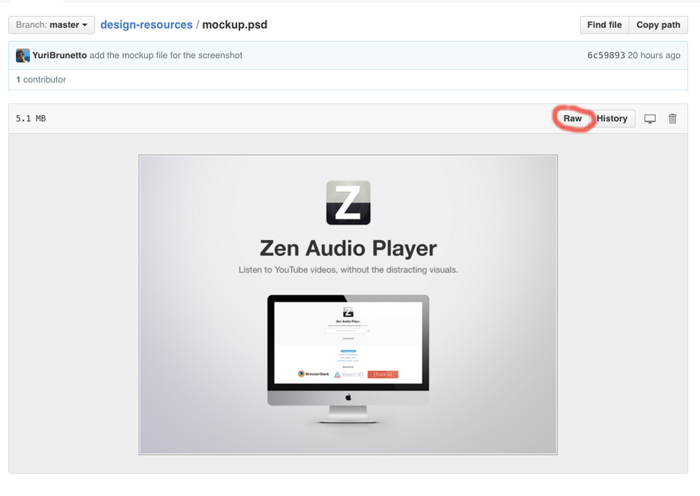
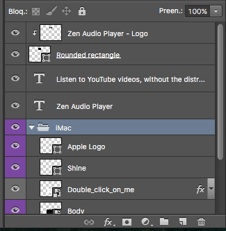
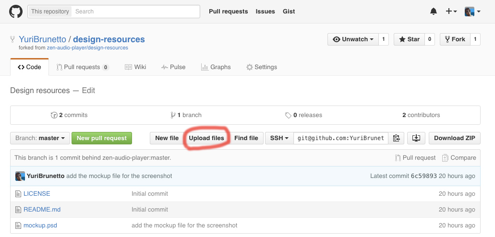

# Design resources for Zen Audio Player :art:

Design resources for the Zen Audio Player. You can contribute with PSDs, icons and other media stuff.

# Usage of the mockup.psd

Download the `mockup.psd` by clicking in it, and after that clicking in `Raw`.

After having downloaded the PSD, open it. In the layers, you'll see this:

The only thing we'll need here is the `Double_click_on_me` layer. Double click on it (in the thumbnail) and it will open another Photoshop document, that is the print itself. Make the awesome changes you wanna do and save it and then close this current document.

Your new PSD is ready! Add it in here by making a pull request.

# New pull request

1. Fork the repository.
2. Go to your forked repository and click in `Upload files`. 
3. Add your awesome brand new PSD and don't forget to explain to us what you did with the PSD.
4. And then, commit the changes!

